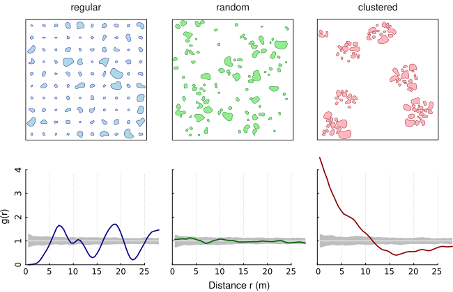

# apcf: Adapted Pair Correlation Function

<!-- badges: start -->
[](https://github.com/rnuske/apcf/actions)
[](https://cloud.drone.io/rnuske/apcf) 
[](https://www.gnu.org/licenses/gpl-3.0.html) 
[](https://cran.r-project.org/package=apcf) 
[](https://cran.r-project.org/package=apcf) 
[](https://doi.org/10.5281/zenodo.2535612) 
<!-- badges: end -->


The Adapted Pair Correlation Function transfers the concept of the pair correlation function (PCF) from point patterns to patterns of objects of finite size and irregular shape (eg. lakes within a country). The pair correlation function describes the spatial distribution of objects. It assesses whether patterns are random, aggregated or regularly spaced. The PCF is non-cumulative and, thus, particularly suitable to reveal critical scales of the pattern. Under complete spatial randomness (CSR), *g(r) = 1*. Values *g(r) < 1* suggest inhibition between objects and values *g(r) > 1* suggest clustering.

The following figure shows three simulated patterns (regular, random, clustered; from Nuske et al. 2009) to demonstrate the behavior of the PCF in three extreme cases (colored line: estimated function; white line: theoretical value of the function under the null hypothesis of complete spatial randomness; grey area: 95% confidence envelope under the null hypothesis, computed by Monte Carlo simulation using 199 replicates). 



</br>
This is a reimplementation of the Adapted Pair Correlation Function (Nuske et al. 2009) in C++ using the GEOS library.

The main steps are (i) the construction of nullmodels by randomizing the objects of the original pattern within the study area, (ii) the edge correction by determining the proportion of a buffer within the study area, and (iii) the calculation of the shortest distances between the objects.


## Installation
The stable version can be installed from CRAN
```r
install.packages("apcf")
```

and the development version is available from Github using the package `remotes`
```r
remotes::install_github("rnuske/apcf")
```


## Usage
```r
# calculate distances between patches of original pattern and 3 nullmodels
# number of nullmodels should by at least 199 and better yet 999
ds <- pat2dists(area=sim_area, pattern=sim_pat_reg, max_dist=25, n_sim=3)

# derive PCF and envelope from distances
pcf <- dists2pcf(ds, r=0.2, r_max=25, stoyan=0.15, n_rank=1)

# plot PCF
plot(x=pcf, xlim=c(0, 20), ylim=c(0, 2.2))
```


## Requirements
For Unix-alikes GEOS (>= 3.4.0) is required.

On Ubuntu bionic (18.04) and beyond one can install the dependency simply with `sudo apt install libgeos-dev`. 
In earlier Ubuntu version either add [ubuntugis-unstable](http://ppa.launchpad.net/ubuntugis/ubuntugis-unstable/ubuntu/) to the `sources.list` and use above command or compile GEOS from source.


## Links
* [GEOS](https://libgeos.org)
* [Rcpp Website](https://www.rcpp.org)


## References
Nuske, R.S., Sprauer, S. and Saborowski, J. (2009): Adapting the pair-correlation function for analysing the spatial distribution of canopy gaps. Forest Ecology and Management 259(1): 107–116. https://doi.org/10.1016/j.foreco.2009.09.050
