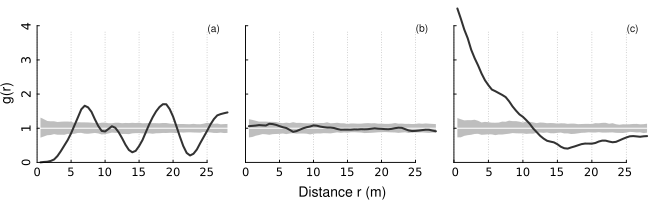

```{r include=FALSE}
knitr::opts_chunk$set(collapse = TRUE)
library(apcf)
```

The apcf package provides methods to analyse patterns of objects of finite size and irregular shape using the adapted Pair-Correlation Function (PCF) as proposed by Nuske et al. (2009).

## Background
The method suggested by Nuske et al. (2009) requires a certain number of null models for correcting the biased PCF and constructing a pointwise critical envelope. Null models are constructed by randomly moving (shift and rotation) the objects within the study area.

The alpha level of the pointwise critical envelope is $\alpha = {n\_rank * 2} / {n\_sim + 1}$ according to (Besag and Diggle 1977, Buckland 1984, Stoyan and Stoyan 1994).

For the edge correction (based on Ripley 1981) a buffer with buffer distance $r_{ij}$ is constructed around the object *i* for each pair of objects *i* and *j*. The object *j* is then weighted by the inverse of the proportion $p_{ij}$ of the buffer perimeter being within the study area.

Being a density function the frequently used Epanechnikov kernel (Silverman 1986, Stoyan and Stoyan 1994) is used for smoothing the PCF. The smoothing is controlled by the bandwith parameter $\delta$ and the step size *r*. Penttinen et al. (1992) and Stoyan and Stoyan (1994) suggest to set *c* aka stoyan-parameter of $c / {\sqrt{\lambda}}$ between 0.1 and 0.2 with $\lambda$ being the intensity of the pattern.

To separate the computationally intensive part (randomization of the objects and the calculation of the proportion of the buffer inside the study area) from the smoothing of the PCF we use a two step approach:

- calculate distances and buffer fractions for original and randomized patterns
- turn the distances and buffer fractions into a PCF together with a pointwise critical envelope


## Example Data
To present the workflow we make use of the simulated patterns presented in Nuske et al. (2009). WKB representations of the data are part of this package and documented as `?sim_patterns`.


## Workflow
### Pattern to Distances
`pat2dists()` calculates distances between all object of a pattern closer than `max_dist` and determines the fraction of a buffer with distance `dist` inside the study area (needed for edge correction). It randomizes the original pattern to generate `n_sim` null models used for correcting the biased PCF and constructing an envelope. It's advised against setting `n_sim < 199`, better still is 999 or even 9999.

It returns an object of class `dists` containing a data.frame with the columns `sim`, `dist`, and `prop` with an indicator of the model run (`0:n_sim`), distances between the objects of the patterns, and the proportion of a buffer with distance dist inside the study area. The size of the study area, the total number of objects, and the maximum distance are passed along as well.

```{r}
# it's advised against setting n_sim < 199
dists <- pat2dists(area=sim_area, pattern=sim_pat_reg, 
                   max_dist=25, n_sim=9, verbose=FALSE)
head(dists)
```


### Distances to PCF
`dists2pcf()` estimates the adapted pair correlation function of a pattern of polygons together with a pointwise critical envelope using kernel methods based on distances between objects.

It returns an object of class `fv_pcf` containing the function values of the PCF and the pointwise critical envelope. The number of null models, the rank of envelope value among the n_sim values and the bandwith/stoyan parameter are passed along.

```{r}
pcf <- dists2pcf(dists, r=0.2, r_max=25, stoyan=0.15, n_rank=1)
head(pcf)
```


### Plotting the PCF
`plot.fv_pcf()` is a plot method for the class `fv_pcf`. It draws a pair correlation function and a pointwise critical envelope if available.

```{r, fig.width=4, fig.height=3.5}
plot(pcf)
```


A plot of PCFs of the simulated patterns shown above having (a) regular, (b) random, and (c) clustered objects.
Black line: estimated function;
white line: theoretical value of the function under the null hypothesis of complete spatial randomness;
grey area: 95% confidence envelope under the null hypothesis, computed by Monte Carlo simulation using 199 replicates.
Values g(r) < 1 suggest inhibition between points and values g(r) > 1 suggest clustering.




## Technical Details
The adapted pair-correlation functions was original implemented in the Geodatabase `PostGIS`. `PostGIS` offers all necessary geoprocessing methods and is easy to handle knowing databases and SQL. The need to create many temporary tables and countless transformations of the geodata stored as WKB in the database into the "GEOS" format for geometric operations made the process very slow.

In this package the geometric operations (measuring distances between objects, buffers, intersects, and randomly moving objects) are carried out by [`GEOS`](https://libgeos.org). The geodata is read and transformed to `GEOS` format only once. All further manipulations are within the `GEOS` world. Using the GEOS library from R was made possible by [`Rcpp`](https://www.rcpp.org).


## References
Besag, J. and Diggle, P.J. (1977): Simple Monte Carlo tests for spatial pattern. Journal of the Royal Statistical Society. Series C (Applied Statistics), 26(3): 327–333. 

Buckland, S.T. (1984): Monte Carlo Confidence Intervals. Biometrics, 40(3): 811–817.

Nuske, R.S., Sprauer, S. and Saborowski, J. (2009): Adapting the pair-correlation function for analysing the spatial distribution of canopy gaps. Forest Ecology and Management, 259(1): 107–116.

Ripley, B.D. (1981): Spatial Statistics. John Wiley & Sons, New York.

Silverman, B.W. (1986): Density Estimation for Statistics and Data Analysis. Chapman and Hall, London.

Stoyan, D. and Stoyan, H. (1994) Fractals, random shapes and point fields: Methods of geometrical statistics. John Wiley & Sons, Chichester.
